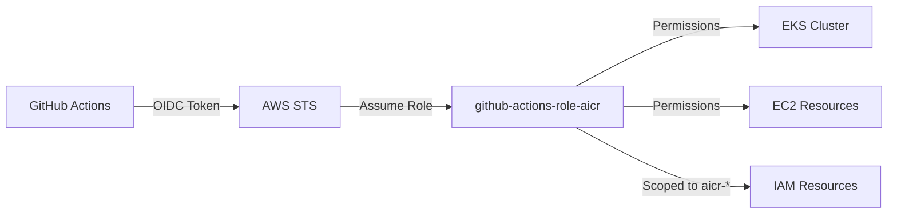

# AWS Account OIDC Setup for GitHub Actions

Terraform configuration for AWS IAM OIDC federation with GitHub Actions. Enables keyless authentication for the daily UAT workflow that creates ephemeral EKS clusters.

## Prerequisites

- [Terraform](https://www.terraform.io/downloads.html) >= 1.9.5
- [AWS CLI](https://docs.aws.amazon.com/cli/latest/userguide/install-cliv2.html) configured with administrative credentials
- AWS account with permissions to create IAM roles and policies
- GitHub OIDC provider already registered in the AWS account (`token.actions.githubusercontent.com`)

## What This Creates

- **IAM Role**: `github-actions-role-aicr` with scoped permissions for EKS cluster lifecycle
- **IAM Policy**: Scoped permissions for EKS, EC2, CloudFormation, Auto Scaling, KMS, CloudWatch Logs, and IAM (restricted to `aicr-*` resources with explicit privilege escalation deny)
- **Trust Relationship**: OIDC federation limited to `NVIDIA/aicr` repository, `main` branch only

The OIDC provider itself is **not** managed by this configuration. It references the existing account-wide provider via a `data` source. This avoids conflicts when multiple projects share the same provider.

## Architecture



## Usage

1. **Initialize Terraform:**
   ```bash
   terraform init
   ```

2. **Preview changes:**
   ```bash
   terraform plan
   ```

3. **Apply:**
   ```bash
   terraform apply
   ```

4. **Note the outputs** for use in GitHub Actions:
   ```bash
   terraform output
   ```

To override defaults, pass variables at apply time:
```bash
terraform apply -var="aws_region=us-west-2"
```

## Configuration Variables

| Variable | Description | Default |
|----------|-------------|---------|
| `aws_region` | AWS region for resources | `us-east-1` |
| `git_repo` | GitHub repository (format: owner/repo) | `NVIDIA/aicr` |
| `github_actions_role_name` | Name for the IAM role | `github-actions-role-aicr` |
| `oidc_provider_url` | GitHub OIDC provider URL | `https://token.actions.githubusercontent.com` |
| `oidc_audience` | OIDC audience | `sts.amazonaws.com` |

## Permissions Granted

### Core EKS Operations
- **EKS**: Full cluster, node group, and add-on lifecycle (`eks:*`)

### Supporting AWS Services
- **EC2**: VPC, subnet, security group, route table, and instance management (`ec2:*`)
- **IAM**: Scoped to `aicr-*` prefixed roles, instance profiles, and policies only. Also allows EKS service-linked roles under `aws-service-role/*`
- **Auto Scaling**: Node group scaling (`autoscaling:*`)
- **CloudFormation**: EKS stack management (`cloudformation:*`)
- **STS**: `GetCallerIdentity`, `AssumeRole`, `TagSession` only
- **SSM**: Read-only (`GetParameter`, `GetParameters`, `GetParametersByPath`)
- **KMS**: EKS envelope encryption (`CreateGrant`, `DescribeKey`, `CreateAlias`, `DeleteAlias`)
- **CloudWatch Logs**: EKS control plane logging (`CreateLogGroup`, `DeleteLogGroup`, `DescribeLogGroups`, `PutRetentionPolicy`, `TagResource`)

### Privilege Escalation Deny

The following actions are explicitly denied to prevent privilege escalation:
- `iam:CreateUser`
- `iam:CreateLoginProfile`
- `iam:AttachUserPolicy`
- `iam:PutUserPolicy`
- `iam:CreateAccessKey`

## GitHub Actions Integration

### 1. Get Terraform Outputs
```bash
terraform output GITHUB_ACTIONS_ROLE_ARN
terraform output OIDC_PROVIDER_ARN
terraform output AWS_ACCOUNT_ID
```

### 2. Workflow Configuration

See `.github/workflows/uat-aws.yaml` for the full workflow. Key auth step:

```yaml
permissions:
  contents: read
  actions: read
  id-token: write  # Required for OIDC

jobs:
  integration-test-aws:
    runs-on: ubuntu-latest
    env:
      AWS_ACCOUNT_ID: "615299774277"  # From terraform output
      AWS_REGION: "us-east-1"
      GITHUB_ACTIONS_ROLE_NAME: "github-actions-role-aicr"

    steps:
      - name: Configure AWS credentials
        uses: aws-actions/configure-aws-credentials@61815dcd50bd041e203e49132bacad1fd04d2708  # v5.1.1
        with:
          role-to-assume: "arn:aws:iam::${{ env.AWS_ACCOUNT_ID }}:role/${{ env.GITHUB_ACTIONS_ROLE_NAME }}"
          aws-region: ${{ env.AWS_REGION }}
          role-session-name: GitHubActions-UAT-AICR
```

## Security

- **No long-lived credentials**: OIDC tokens for temporary, scoped access
- **Repository-scoped**: Only `NVIDIA/aicr` repository can assume the role
- **Branch-restricted**: Only `main` branch is allowed (schedule + workflow_dispatch)
- **Time-limited sessions**: AWS credentials automatically expire
- **Privilege escalation denied**: Explicit deny on user/credential creation
- **Audit trail**: All actions logged in AWS CloudTrail with GitHub context
- **OIDC provider not managed**: Data source reference avoids cross-project state conflicts

### Trust Policy

```hcl
condition {
  test     = "StringEquals"
  variable = "token.actions.githubusercontent.com:aud"
  values   = ["sts.amazonaws.com"]
}

condition {
  test     = "StringLike"
  variable = "token.actions.githubusercontent.com:sub"
  values   = ["repo:NVIDIA/aicr:ref:refs/heads/main"]
}
```

Only `main` branch workflows can assume this role:
- `repo:NVIDIA/aicr:ref:refs/heads/main` (main branch)
- Other branches, PRs, tags, and forks are **rejected**

## Outputs

| Output | Description | Usage |
|--------|-------------|--------|
| `GITHUB_ACTIONS_ROLE_ARN` | ARN of the GitHub Actions IAM role | Use in workflow `role-to-assume` |
| `OIDC_PROVIDER_ARN` | ARN of the GitHub OIDC provider | Reference for trust relationships |
| `AWS_ACCOUNT_ID` | AWS account ID | Use in workflow environment variables |
| `AWS_REGION` | AWS region | Use in workflow environment variables |
| `GITHUB_ACTIONS_ROLE_NAME` | IAM role name | For AWS CLI operations |

## State Management

This configuration uses **local state** (no remote backend). The Terraform state file is not committed to the repository. If multiple administrators need to manage this infrastructure, consider adding an S3 backend:

```hcl
terraform {
  backend "s3" {
    bucket = "your-terraform-state-bucket"
    key    = "uat-aws-account/terraform.tfstate"
    region = "us-east-1"
  }
}
```

## Cleanup

To remove all managed resources (role + policy, not the OIDC provider):
```bash
terraform destroy
```

## Troubleshooting

### Common Issues

1. **GitHub Actions authentication failure** (`Not authorized to perform sts:AssumeRoleWithWebIdentity`):
   - Verify workflow is running from `main` branch (other branches are rejected by trust policy)
   - Ensure `permissions.id-token: write` is set in workflow
   - Check that the repository name matches `NVIDIA/aicr` exactly

2. **Permission denied during Terraform apply**:
   ```bash
   aws iam list-roles  # Test IAM access
   aws sts get-caller-identity  # Verify current user
   ```

3. **OIDC provider not found**:
   The OIDC provider must already exist in the account. Create it via another Terraform config or manually:
   ```bash
   aws iam create-open-id-connect-provider \
     --url https://token.actions.githubusercontent.com \
     --client-id-list sts.amazonaws.com \
     --thumbprint-list 6938fd4d98bab03faadb97b34396831e3780aea1
   ```

### Debugging

Enable debug logging in workflow:
```yaml
env:
  ACTIONS_STEP_DEBUG: true
  ACTIONS_RUNNER_DEBUG: true
```

## Validation

After deployment, verify the setup:

```bash
# 1. Check OIDC provider exists
aws iam get-open-id-connect-provider \
  --open-id-connect-provider-arn "arn:aws:iam::$(aws sts get-caller-identity --query Account --output text):oidc-provider/token.actions.githubusercontent.com"

# 2. Verify role exists
aws iam get-role --role-name github-actions-role-aicr

# 3. Check role trust policy
aws iam get-role --role-name github-actions-role-aicr \
  --query 'Role.AssumeRolePolicyDocument' --output json

# 4. List attached policies
aws iam list-attached-role-policies --role-name github-actions-role-aicr
```

## References

- [AWS IAM OIDC Documentation](https://docs.aws.amazon.com/IAM/latest/UserGuide/id_roles_providers_create_oidc.html)
- [GitHub Actions OIDC](https://docs.github.com/en/actions/deployment/security-hardening-your-deployments/about-security-hardening-with-openid-connect)
- [AWS Configure Credentials Action](https://github.com/aws-actions/configure-aws-credentials)
- [EKS User Guide](https://docs.aws.amazon.com/eks/latest/userguide/)
